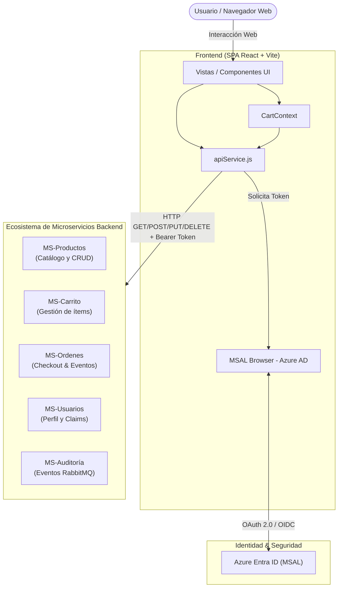

# NexusTech — Frontend E-Commerce 🛒⚡

Aplicación web moderna tipo SPA (Single Page Application) desarrollada para la plataforma de comercio electrónico **NexusTech**, especializada en tecnología, electrónica, notebooks, smartphones, componentes y gaming.

El frontend está desarrollado con **React 18** y **Vite**, gestiona autenticación corporativa/segura mediante **Microsoft Entra ID (Azure AD / MSAL)** y se conecta a una arquitectura distribuida de microservicios alojados en la nube.

---

## 📋 Tabla de Contenidos

- [Características Principales](#-características-principales)
- [Arquitectura del Sistema](#-arquitectura-del-sistema)
- [Stack Tecnológico](#-stack-tecnológico)
- [Estructura del Proyecto](#-estructura-del-proyecto)
- [Variables de Entorno](#-variables-de-entorno)
- [Integración con Microservicios](#-integración-con-microservicios)
- [Instalación y Ejecución Local](#-instalación-y-ejecución-local)
- [Construcción y Despliegue con Docker](#-construcción-y-despliegue-con-docker)
- [Pipeline de CI/CD (GitHub Actions)](#-pipeline-de-cicd-github-actions)
- [Seguridad y Autenticación](#-seguridad-y-autenticación)

---

## ✨ Características Principales

- **Catálogo Interactivo**: Búsqueda en tiempo real por palabras clave y filtrado dinámico por categorías de productos.
- **Detalle de Producto**: Información técnica, galería/imagen del producto y selector de cantidades.
- **Carrito de Compras en la Nube**: Persistencia del carrito por usuario conectado al microservicio de carrito mediante React Context (`CartContext`).
- **Checkout y Pedidos**: Creación de órdenes sincronizadas con descuento asíncrono de stock, historial y trazabilidad del estado de las compras.
- **Perfil de Usuario**: Consulta de claims JWT y gestión de datos de despacho (nombre, dirección, comuna, ciudad, región).
- **Panel Administrativo (CRUD)**: Creación, actualización y eliminación de productos del catálogo para administradores autenticados.
- **Control de Acceso Basado en Roles (RBAC)**: Lectura e inspección dinámica del rol del usuario a través del token JWT (ID Token y Access Token). Si el usuario posee rol **Admin**, se muestra el apartado «Administrar» en la barra de navegación y se habilita la gestión; si posee rol **User**, el apartado queda oculto y la ruta `/admin` protegida.
- **Autenticación con Azure AD (MSAL)**: Inicio y cierre de sesión seguro mediante popup, tokens JWT (Bearer) automáticos y fallback interactivo.
- **Formateo de Moneda Local**: Moneda chilena (CLP) formateada mediante la API estándar de internacionalización `Intl.NumberFormat`.
- **Diseño Responsive y Accesible**: Optimizado para dispositivos móviles, tablets y escritorio con menú hamburguesa y avisos de estado accesibles.

---

## 🏛 Arquitectura del Sistema



---

## 🛠 Stack Tecnológico

| Categoría | Tecnología / Librería | Versión | Propósito |
| :--- | :--- | :--- | :--- |
| **Framework** | [React](https://react.dev/) | `^18.2.0` | Biblioteca de UI reactiva |
| **Tooling / Bundler** | [Vite](https://vitejs.dev/) | `^5.2.0` | Empaquetador ultrarrápido y servidor de desarrollo |
| **Enrutador** | [React Router DOM](https://reactrouter.com/) | `^6.23.1` | Gestión de navegación y rutas dinámicas SPA |
| **Autenticación** | [@azure/msal-browser](https://github.com/AzureAD/microsoft-authentication-library-for-js) / [@azure/msal-react](https://github.com/AzureAD/microsoft-authentication-library-for-js) | `^3.11.0` / `^2.0.14` | Autenticación y consumo de APIs protegidas con Azure AD |
| **Servidor Web Producción** | [Nginx Alpine](https://nginx.org/) | Alpine | Servidor web HTTP, compresión y soporte para rutas SPA |
| **Contenedores** | [Docker](https://www.docker.com/) & Docker Compose | Multi-stage | Empaquetado portable para staging y producción |
| **Despliegue & Cloud** | [AWS ECR](https://aws.amazon.com/ecr/), [AWS EC2](https://aws.amazon.com/ec2/), [AWS SSM](https://aws.amazon.com/systems-manager/) | - | Registro de imágenes y ejecución remota de scripts de despliegue |

---

## 📁 Estructura del Proyecto

```text
Frontend_dev/
├── .github/
│   └── workflows/
│       └── deploy-frontend.yml    # Pipeline de CI/CD para compilación y despliegue
├── src/
│   ├── api/
│   │   └── apiService.js          # Métodos HTTP para los microservicios con inyección de JWT
│   ├── components/
│   │   ├── Footer.jsx             # Pie de página de la aplicación
│   │   ├── Icons.jsx              # Set de iconos SVG reutilizables
│   │   ├── Navbar.jsx             # Barra de navegación superior (búsqueda, login, carrito)
│   │   ├── ProductCard.jsx        # Tarjeta de producto para el catálogo
│   │   └── ProductImage.jsx       # Componente de imagen con fallback visual
│   ├── context/
│   │   ├── CartContext.jsx        # Proveedor de estado global para el carrito de compras
│   │   └── RoleContext.jsx        # Proveedor reactivo de roles de usuario desde el token JWT
│   ├── pages/
│   │   ├── Account.jsx            # Gestión de datos personales y despacho (muestra rol)
│   │   ├── Admin.jsx              # Panel de administración para gestión de productos (restringido a Admin)
│   │   ├── Audit.jsx              # Panel de auditoría de eventos RabbitMQ (restringido a Admin)
│   │   ├── Cart.jsx               # Resumen del carrito y checkout
│   │   ├── Home.jsx               # Vista de inicio y catálogo interactivo
│   │   ├── Orders.jsx             # Listado de órdenes realizadas por el usuario
│   │   └── ProductDetail.jsx      # Ficha detallada de un producto
│   ├── utils/
│   │   ├── auth.js                # Decodificación de tokens JWT y validación de roles
│   │   └── format.js              # Funciones auxiliares (formato CLP)
│   ├── App.css                    # Estilos globales y reglas de diseño
│   ├── App.jsx                    # Configuración de rutas y plantillas autenticadas
│   ├── AuthConfig.js              # Configuración del cliente MSAL y endpoints de APIs
│   └── main.jsx                   # Punto de entrada, inicialización de MSAL y Providers
├── .env.example                   # Ejemplo de variables de entorno requeridas
├── .gitignore                     # Exclusiones de Git
├── docker-compose.yml             # Orquestación de contenedor en entorno de ejecución
├── Dockerfile                     # Construcción en dos etapas (Node.js Build + Nginx)
├── index.html                     # Plantilla HTML base
├── nginx.conf                     # Configuración del servidor Nginx (try_files y caché)
├── package.json                   # Definición de dependencias y scripts de ejecución
└── vite.config.js                 # Configuración del compilador Vite
```

---

## ⚙️ Variables de Entorno

Crea un archivo `.env` en la raíz del proyecto tomando como plantilla `.env.example`:

```bash
cp .env.example .env
```

| Variable | Descripción | Ejemplo / Formato |
| :--- | :--- | :--- |
| `VITE_AZURE_CLIENT_ID` | Application (client) ID registrado en Azure Entra ID | `xxxxxxxx-xxxx-xxxx-xxxx-xxxxxxxxxxxx` |
| `VITE_AZURE_TENANT_ID` | Directory (tenant) ID de la organización en Azure | `yyyyyyyy-yyyy-yyyy-yyyy-yyyyyyyyyyyy` |
| `VITE_AZURE_SCOPE` | Ámbito (Scope) de permisos expuesto por la API | `api://<VITE_AZURE_CLIENT_ID>/write-read` |
| `VITE_MS_USUARIOS_URL` | URL base del microservicio de usuarios | `https://api.tudominio.com/api/v1/usuarios` |
| `VITE_MS_PRODUCTOS_URL` | URL base del microservicio de catálogo de productos | `https://api.tudominio.com/api/v1/productos` |
| `VITE_MS_CARRITO_URL` | URL base del microservicio de carrito de compras | `https://api.tudominio.com/api/v1/carrito` |
| `VITE_MS_ORDENES_URL` | URL base del microservicio de órdenes y pedidos | `https://api.tudominio.com/api/v1/ordenes` |
| `VITE_MS_AUDITORIA_URL` | URL base del microservicio de auditoría de eventos | `http://localhost:8086/api/v1/auditoria` |

> ⚠️ **Nota Importante**: Al ser una aplicación empaquetada por Vite, todas las variables con prefijo `VITE_` se sustituyen de forma estática en el bundle JavaScript durante la etapa de construcción (`npm run build`).

---

## 🔌 Integración con Microservicios

El archivo `src/api/apiService.js` centraliza las peticiones HTTP y la resolución de tokens de autorización:

### 1. MS-PRODUCTOS
- `GET /` — Obtiene todos los productos del catálogo (público).
- `GET /{id}` — Obtiene los datos detallados de un producto por su identificador (público).
- `GET /categoria/{categoria}` — Filtra productos por categoría (público).
- `POST /` — Crea un nuevo producto (requiere autenticación).
- `PUT /{id}` — Modifica un producto existente (requiere autenticación).
- `DELETE /{id}` — Elimina un producto (requiere autenticación).

### 2. MS-CARRITO
- `GET /` — Retorna el estado y los ítems del carrito del usuario activo.
- `POST /items` — Agrega o suma unidades de un producto al carrito.
- `DELETE /items/{productoId}` — Elimina un ítem específico del carrito.
- `DELETE /` — Vacía el carrito por completo.

### 3. MS-ORDENES
- `POST /` — Envía los ítems del carrito para generar formalmente un pedido, iniciando el flujo asíncrono de stock y notificación.
- `GET /` — Consulta el historial de pedidos asociados al usuario autenticado.

### 4. MS-USUARIOS
- `GET /me` — Lee y valida los claims del usuario desde el JWT emitido.
- `GET /{id}` — Obtiene la información de perfil registrada.
- `POST /` — Registra la información de perfil y despacho del usuario.
- `PUT /{id}` — Actualiza los datos de dirección y despacho.

### 5. MS-AUDITORIA (Exclusivo Rol Admin)
- `GET /` o `GET /api/v1/auditoria` — Obtiene la lista ordenada de eventos asíncronos procesados desde RabbitMQ (`tipoEvento`, `payload` en JSON, `recibidoEn`). Requiere obligatoriamente un token JWT válido con rol `Admin`.

---

## 🚀 Instalación y Ejecución Local

### Prerrequisitos
- [Node.js](https://nodejs.org/) v18 o superior.
- Gestor de paquetes `npm`.

### Pasos

1. **Clonar el repositorio y entrar al directorio:**
   ```bash
   cd Frontend_dev
   ```

2. **Instalar dependencias:**
   ```bash
   npm install
   ```

3. **Configurar el entorno:**
   ```bash
   cp .env.example .env
   # Editar .env con los valores correctos de Azure AD y las URLs de los microservicios
   ```

4. **Ejecutar el servidor de desarrollo:**
   ```bash
   npm run dev
   ```
   La aplicación estará disponible de forma predeterminada en `http://localhost:5173`.

5. **Compilar para producción localmente:**
   ```bash
   npm run build
   ```
   Los archivos estáticos generados se guardarán en la carpeta `dist/`.

---

## 🐳 Construcción y Despliegue con Docker

El proyecto cuenta con un `Dockerfile` optimizado en dos etapas (Multi-stage build):
1. **Build Stage**: Basado en `node:18-alpine`, inyecta los `ARG` de Vite y compila el bundle a producción.
2. **Production Stage**: Basado en `nginx:alpine`, sirve los archivos estáticos generados con la configuración de `nginx.conf`.

### 1. Construir la imagen Docker localmente
```bash
docker build \
  --build-arg VITE_AZURE_CLIENT_ID="tu-client-id" \
  --build-arg VITE_AZURE_TENANT_ID="tu-tenant-id" \
  --build-arg VITE_AZURE_SCOPE="tu-scope" \
  --build-arg VITE_MS_USUARIOS_URL="url-usuarios" \
  --build-arg VITE_MS_PRODUCTOS_URL="url-productos" \
  --build-arg VITE_MS_CARRITO_URL="url-carrito" \
  --build-arg VITE_MS_ORDENES_URL="url-ordenes" \
  --build-arg VITE_MS_AUDITORIA_URL="url-auditoria" \
  -t frontend-ux:latest .
```

### 2. Ejecutar el contenedor
```bash
docker run -d -p 80:80 --name ecommerce-frontend frontend-ux:latest
```

---

## 🔄 Pipeline de CI/CD (GitHub Actions)

El flujo de despliegue automatizado está definido en `.github/workflows/deploy-frontend.yml`:

- **Disparador**: Se ejecuta automáticamente ante cada `push` en la rama `deploy`.
- **Flujo de trabajo**:
  1. Autenticación en **AWS** con credenciales temporales y región `us-east-1`.
  2. Autenticación en **AWS ECR** y creación del repositorio `frontend-ux` si no existe.
  3. Compilación de la imagen Docker inyectando los secretos de entorno del repositorio (`secrets.VITE_*`).
  4. Publicación (push) de la imagen a ECR con tag del commit y tag `latest`.
  5. Envío de comando remoto mediante **AWS Systems Manager (SSM)** a la instancia EC2 (`secrets.EC2_INSTANCE_ID`).
  6. En la instancia EC2: login en ECR, configuración de red `ecommerce-network`, actualización de `docker-compose.yml` y despliegue sin tiempo de inactividad (`docker compose pull && docker compose up -d`).

---

## 🔒 Seguridad y Autenticación

- **Autenticación Delegada**: Toda la identidad es manejada por Microsoft Entra ID mediante el protocolo OAuth 2.0 / OpenID Connect. Las contraseñas nunca pasan por el frontend.
- **Protección de Rutas**: Componentes como `/pedidos`, `/cuenta` y `/admin` utilizan plantillas condicionales `<AuthenticatedTemplate>` y `<UnauthenticatedTemplate>`.
- **Control de Acceso Basado en Roles (RBAC vía JWT)**: El hook `useUserRole` y el contexto `RoleContext` inspeccionan y decodifican los tokens (`idTokenClaims` y el payload del Access Token) para extraer las afirmaciones de roles (`roles`, `role`, `rol` o URIs de Azure). Los usuarios con rol `User` no visualizan el enlace «Administrar» en el Navbar y tienen bloqueada la ruta `/admin` mediante el componente guardián `AdminRoute`.
- **Manejo Seguro de Tokens**: Las peticiones privadas adquieren el access token mediante `acquireTokenSilent` de MSAL; en caso de expiración o sesión no interactiva, se despliega el popup para renovación.
- **Cabeceras de Autorización**: Todos los endpoints protegidos envían el token en la cabecera estándar `Authorization: Bearer <token>`.
- **Servidor Nginx**: `nginx.conf` implementa `try_files $uri $uri/ /index.html;` para prevenir errores 404 en la navegación de rutas cliente y configura cabeceras de caché inmutable para optimizar la entrega de recursos estáticos (`js`, `css`, `svg`, `png`).
